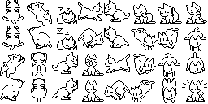

# Cursor Cat (Oneko) - Browser Extension

## This is a fork of [oneko.js](https://github.com/adryd325/oneko.js). I did not make this. All credit goes to [@adryd325](https://github.com/adryd325)

This is a browser extension that adds a cute cat to your web browser that chases your cursor. It is a fork of the original [oneko.js](https://github.com/adryd325/oneko.js) project.

While the original `oneko.js` was a script to be included on a single website, this extension allows you to have the cat on any webpage you visit.

## Demo

## How to Install

1.  Clone or download this repository.
2.  Open Chrome and navigate to `chrome://extensions`.
3.  Enable "Developer mode" in the top right corner.
4.  Click "Load unpacked" and select the `oneko-browser-extension` directory.
5.  The cat should now appear on any new page you visit!

## Credits

This project is a fork of [oneko.js](https://github.com/adryd325/oneko.js) by adryd. Thank you for creating such a fun script!

## License

This project is licensed under the MIT License. See the [LICENSE](https://github.com/adryd325/oneko.js/blob/main/LICENSE) file for details.
